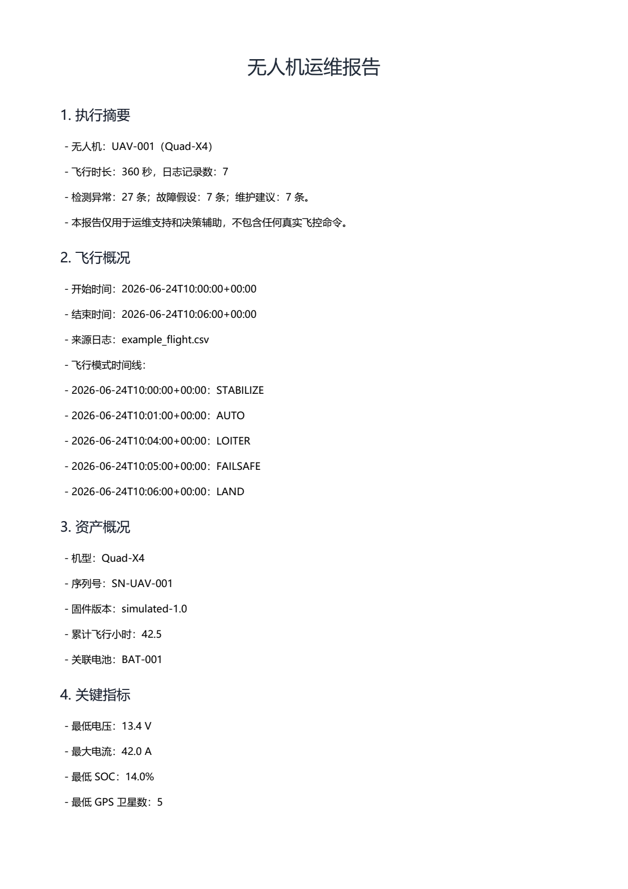
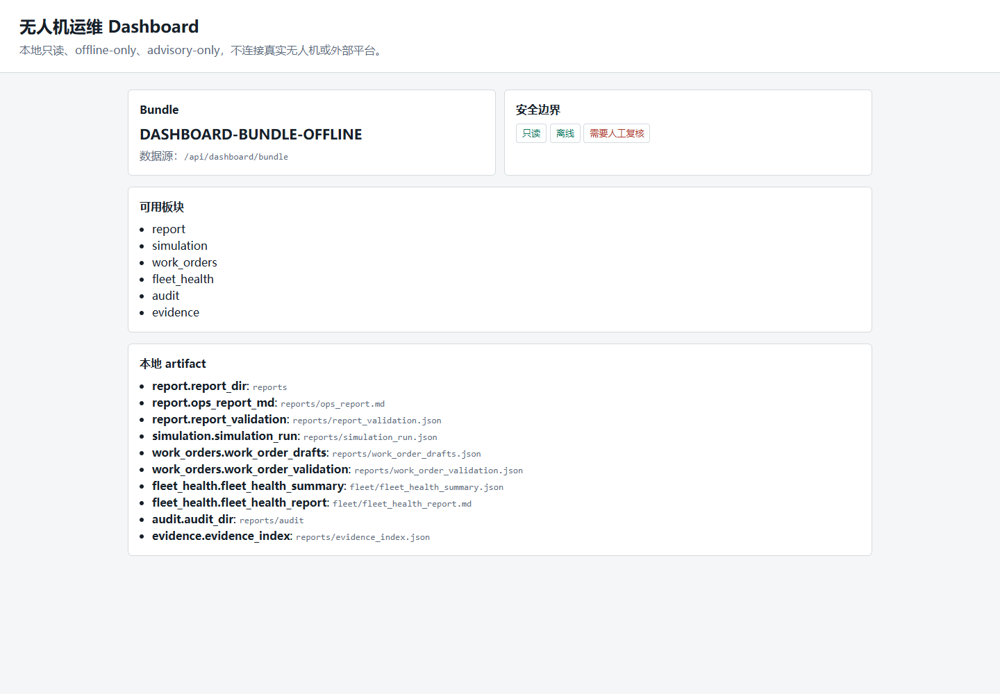
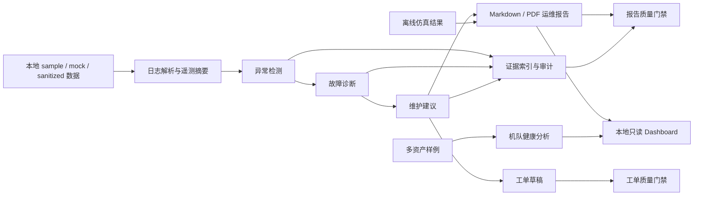

# drone-ops-agent

`drone-ops-agent` 是一个离线优先的无人机运维决策支持平台。它基于 sample / mock / sanitized 飞行数据和资产数据，完成日志解析、异常检测、故障假设、维护建议、运维报告、质量门禁和审计记录生成。

## 3 分钟快速体验

安装 Python 3.11+ 和项目依赖后，在仓库根目录运行：

```bash
python scripts/generate_demo_outputs.py --out demo_outputs
```

命令会生成 49 个本地成果文件。建议先打开：

1. `demo_outputs/reports/ops_report.pdf`：中文无人机运维报告。
2. `demo_outputs/reports/evidence_index.json`：异常、诊断、维护建议与报告之间的证据索引。
3. `demo_outputs/reports/simulation_run.json`：离线/mock 仿真规则命中结果。
4. `demo_outputs/reports/work_order_drafts.md`：等待人工复核的工单草稿。
5. `demo_outputs/fleet/fleet_health_report.md`：多资产机队健康摘要。
6. `demo_outputs/case_studies/case_study_report.md`：15 个离线案例的准确率、证据覆盖率、误报和漏检汇总。

完整演示顺序和讲解脚本见 [`docs/demo_guide.md`](docs/demo_guide.md)。成果包只使用 sample / mock / sanitized 数据，生成目录被 Git 忽略。

## 运行效果

### 中文运维报告



### 本地只读 Dashboard



## 工作流程



## 安全边界

本项目只做运维支持和决策辅助，不直接控制真实无人机。系统不得解锁电机、启动电机、执行起飞、降落、返航、航线飞行、上传固件、修改飞控关键参数、arm/disarm 飞行器或执行任何真实飞控命令。

所有涉及飞行安全、维护安全或飞控参数变更的建议，都必须由人工复核和批准。

## 安装

```bash
python -m venv .venv
.venv\Scripts\activate
pip install -e .[dev]
```

也可以在已有 Python 3.11+ 环境中直接安装：

```bash
pip install -e .[dev]
```

## 运行核心离线流程

完整离线流程：

```bash
drone-ops run-mvp --log data/sample_logs/example_flight.csv --asset data/sample_assets/uav_001.json --out data/sample_reports/
```

分步运行：

```bash
drone-ops analyze-log --log data/sample_logs/example_flight.csv --asset data/sample_assets/uav_001.json --out data/sample_reports/
drone-ops diagnose --summary data/sample_reports/flight_summary.json --asset data/sample_assets/uav_001.json --out data/sample_reports/
drone-ops generate-report --summary data/sample_reports/flight_summary.json --diagnosis data/sample_reports/diagnosis.json --maintenance data/sample_reports/maintenance_recommendations.json --out data/sample_reports/ops_report.md
drone-ops export-pdf --markdown data/sample_reports/ops_report.md --out data/sample_reports/ops_report.pdf
```

未安装 CLI 入口时，可以使用：

```bash
python -m apps.cli.main run-mvp --log data/sample_logs/example_flight.csv --asset data/sample_assets/uav_001.json --out data/sample_reports/
```

## PDF 报告导出

Markdown 运维报告可以导出为本地 PDF。PDF 导出只读取本地 Markdown 报告并写出 PDF 文件，不改变 advisory-only 安全边界，也不会连接真实无人机或执行任何真实动作。

```bash
drone-ops export-pdf --markdown data/sample_reports/ops_report.md --out data/sample_reports/ops_report.pdf
```

未安装 CLI 入口时：

```bash
python -m apps.cli.main export-pdf --markdown data/sample_reports/ops_report.md --out data/sample_reports/ops_report.pdf
```

也可以在生成 Markdown 报告时同步导出 PDF：

```bash
drone-ops generate-report --summary data/sample_reports/flight_summary.json --diagnosis data/sample_reports/diagnosis.json --maintenance data/sample_reports/maintenance_recommendations.json --out data/sample_reports/ops_report.md --pdf data/sample_reports/ops_report.pdf
```

当前 PDF 以可读和结构清楚为目标，支持标题、段落、列表和代码块的基础渲染；复杂 Markdown 表格和精细排版留作后续扩展。

PDF 导出会优先使用环境变量 `DRONE_OPS_PDF_FONT_PATH` 指定的可嵌入 CJK TrueType/OpenType 字体；未设置时会搜索常见 Linux、Windows 和 macOS 系统字体。若环境中没有可用中文字体，请先安装 Noto CJK 等字体，或设置 `DRONE_OPS_PDF_FONT_PATH=/path/to/font.ttf`。

## 报告验证与证据索引

`validate-report` 是离线可信度检查命令，用于验证 `run-mvp` 生成的结构化 JSON、Markdown 报告和 audit JSON 之间的证据链是否完整。它不会连接真实无人机，不会执行 MAVLink command，也不代表真实飞行安全许可。

```bash
drone-ops validate-report --report-dir data/sample_reports/
```

未安装 CLI 入口时，可以使用：

```bash
python -m apps.cli.main validate-report --report-dir data/sample_reports/
```

也可以显式传入各个文件：

```bash
drone-ops validate-report \
  --summary data/sample_reports/flight_summary.json \
  --anomalies data/sample_reports/anomalies.json \
  --diagnosis data/sample_reports/diagnosis.json \
  --maintenance data/sample_reports/maintenance_recommendations.json \
  --report data/sample_reports/ops_report.md \
  --audit-dir data/sample_reports/audit
```

如需写出检查结果和证据索引：

```bash
drone-ops validate-report --report-dir data/sample_reports/ --write-index
```

该命令会生成确定性的 `evidence_index.json` 和 `report_validation.json`。验证内容包括 anomaly、fault hypothesis、maintenance recommendation 的 `evidence_refs`，diagnosis/maintenance 是否能追溯到上游 anomaly、summary 或 diagnosis 证据，高风险输出的 `human_review_required=true`，关键 audit JSON 是否存在，以及 `ops_report.md` 是否包含主要章节和证据引用线索。缺失引用、断裂引用或无法追溯的证据链会作为 validation finding 暴露出来。任何维护或飞行安全建议仍必须由合格人员人工复核。

## 飞行前检查

`preflight-check` 是离线 advisory-only 检查，不会连接真实无人机，也不会授权真实飞行。它读取样例资产、电池、任务、人工观测和 YAML 规则，输出 `GO`、`REVIEW_REQUIRED` 或 `NO_GO`。

```bash
drone-ops preflight-check --asset data/sample_assets/uav_001.json --battery data/sample_assets/battery_001.json --mission data/sample_missions/example_mission.json --observations data/sample_missions/preflight_observations_ok.json --rules data/sample_rules/preflight_rules.yaml --out data/sample_reports/
```

未安装 CLI 入口时：

```bash
python -m apps.cli.main preflight-check --asset data/sample_assets/uav_001.json --battery data/sample_assets/battery_001.json --mission data/sample_missions/example_mission.json --observations data/sample_missions/preflight_observations_ok.json --rules data/sample_rules/preflight_rules.yaml --out data/sample_reports/
```

输出文件为 `preflight_check_result.json` 和 `audit/preflight-check-*.json`。存在 blocking item 时结果为 `NO_GO`；只有 warning 时为 `REVIEW_REQUIRED`；没有 warning 和 blocking item 时才是 `GO`。`NO_GO` 和 `REVIEW_REQUIRED` 必须人工复核，`GO` 也只是离线建议，不代表自动批准真实飞行。

## 状态监控回放

`monitor-replay` 是离线 advisory-only 遥测回放，不会连接真实无人机，也不会执行任何真实动作。它读取本地 telemetry CSV/JSON、无人机资产和 YAML 规则，按时间顺序生成监控事件、状态摘要和 audit JSON。

```bash
drone-ops monitor-replay --telemetry data/sample_logs/example_telemetry.csv --asset data/sample_assets/uav_001.json --rules data/sample_rules/monitoring_rules.yaml --out data/sample_reports/
```

未安装 CLI 入口时：

```bash
python -m apps.cli.main monitor-replay --telemetry data/sample_logs/example_telemetry.csv --asset data/sample_assets/uav_001.json --rules data/sample_rules/monitoring_rules.yaml --out data/sample_reports/
```

输出文件为 `monitoring_summary.json`、`monitoring_events.json` 和 `audit/state-monitoring-*.json`。每个监控事件都包含 `evidence_refs`，可追溯到 telemetry 来源、字段、测量值、阈值和规则 ID。任何 `HIGH` 或 `CRITICAL` 事件都会要求人工复核；即使未来扩展到 MAVLink 遥测，也只能作为 read-only 导入，必须与 MAVLink command execution 严格隔离。

## 离线日志格式扩展

`analyze-log` 支持统一的 `--format` 参数。默认 `auto` 按扩展名识别日志格式：

- `.csv` -> `csv`
- `.json` -> `json`
- `.ulg` -> `px4-ulog`
- `.bin` -> `ardupilot-bin`

```bash
drone-ops analyze-log --log data/sample_logs/example_flight.csv --asset data/sample_assets/uav_001.json --out data/sample_reports --format auto
drone-ops analyze-log --log data/sample_logs/example_flight.json --asset data/sample_assets/uav_001.json --out data/sample_reports --format auto
drone-ops analyze-log --log data/sample_logs/example_px4_mock.ulg --asset data/sample_assets/uav_001.json --out data/sample_reports --format px4-ulog
drone-ops analyze-log --log data/sample_logs/example_ardupilot.bin --asset data/sample_assets/uav_001.json --out data/sample_reports --format ardupilot-bin
```

PX4 ULog 和 ArduPilot BIN 初版只做本地离线解析适配，不连接真实无人机，不执行 MAVLink command，不写飞控参数，也不上传固件。真实 `.ulg` 解析依赖可选 extra：

```bash
pip install -e .[px4]
```

真实 `.bin` 解析依赖可选 extra：

```bash
pip install -e .[ardupilot]
```

默认安装和 `pip install -e .[dev]` 不会强制安装这些可选飞控日志解析库。缺少可选依赖时，CLI 会给出安装提示并退出，不显示 traceback。

日志字段映射和当前覆盖范围记录在 `docs/log_parser_coverage.md`。真实或脱敏 `.ulg` / `.bin` 样例的提交策略记录在 `data/sample_logs/README.md`；当前仓库不内置未经确认的真实二进制日志，只保留 deterministic mock fixtures 和真实样例 placeholder 目录。

## 离线仿真验证

`validate-simulation` 是 simulation-validation skill 的离线 MVP。它只导入 mock/exported simulation result JSON，并基于规则输出 `PASS`、`FAIL` 或 `REVIEW_REQUIRED`，不会启动 PX4、ArduPilot、Gazebo 或真实 SITL 环境。

```bash
drone-ops validate-simulation --scenario data/sample_simulation/example_scenario.json --result data/sample_simulation/example_simulation_result.json --out data/sample_reports/
```

输出文件为 `simulation_run.json` 和 `audit/simulation-validation-*.json`。所有仿真验证输出都包含 `evidence_refs`，并固定要求 `human_review_required=true`。`PASS` 只表示离线仿真导入结果未发现阻断项，不代表真实飞行授权。

v0.7.0 增加了离线/mock simulation scenario matrix 基线：

- 文档：`docs/simulation_scenario_matrix.md`
- 机器可读 fixture：`data/sample_simulation/scenario_matrix.json`

该 matrix 覆盖 nominal flight、battery sag、GPS degradation、motor vibration anomaly、severe temperature issue、missing telemetry fields 和 inconsistent simulation metadata 等场景。它只用于确定性测试和离线导入验证，不会启动或连接任何真实仿真器。

v0.8.0 起，`generate-report` 可以通过 `--simulation <simulation_run.json>` 将离线仿真验证结果纳入 Markdown 运维报告：

```bash
drone-ops generate-report \
  --summary data/sample_reports/flight_summary.json \
  --anomalies data/sample_reports/anomalies.json \
  --diagnosis data/sample_reports/diagnosis.json \
  --maintenance data/sample_reports/maintenance_recommendations.json \
  --simulation data/sample_reports/simulation_run.json \
  --out data/sample_reports/ops_report.md
```

该报告章节只展示离线/mock 仿真导入结果、规则命中详情和证据引用，不代表真实飞行授权。

报告还会汇总同一输出目录下的 audit JSON，展示审计摘要、日志解析元数据和人工复核清单。解析元数据来自 `flight-log-analysis` audit，包括 requested format、actual format、parser name、parser version、warnings 和 parser metadata；人工复核清单用于提醒运维人员复核异常、诊断、维护建议和离线仿真结论。

使用 `--pdf` 同步导出 PDF 时，v0.8.0 新增的仿真验证、审计摘要、日志解析元数据和人工复核清单章节会随 Markdown 报告一起进入 PDF。PDF 仍只是本地离线报告，不代表真实飞行授权。

## 工单草稿

`generate-work-orders` 可以把 `maintenance_recommendations.json` 转换为本地工单草稿，用于人工复核和后续维护排程讨论。它只读取本地维护建议和资产 JSON，不会连接真实 CMMS、Jira、飞书或企业微信，不会自动派单，也不会执行任何维护动作。

```bash
drone-ops generate-work-orders \
  --maintenance data/sample_reports/maintenance_recommendations.json \
  --asset data/sample_assets/uav_001.json \
  --out data/sample_reports/
```

未安装 CLI 入口时，可以使用：

```bash
python -m apps.cli.main generate-work-orders \
  --maintenance data/sample_reports/maintenance_recommendations.json \
  --asset data/sample_assets/uav_001.json \
  --out data/sample_reports/
```

输出文件为 `work_order_drafts.json`、`work_order_drafts.md` 和 `audit/work-order-drafting-*.json`。每条工单草稿都会保留来源维护建议、`evidence_refs`、审批要求、预计工作量、`status=DRAFT` 和 `human_review_required=true`。这些输出只代表离线建议草稿，必须由合格人员人工确认后才能进入真实维护流程。

`validate-work-orders` 可以对本地工单草稿做离线质量门禁，检查草稿是否保留证据、来源维护建议、人工审批字段和 `DRAFT` 状态。

```bash
drone-ops validate-work-orders \
  --drafts data/sample_reports/work_order_drafts.json \
  --out data/sample_reports/
```

未安装 CLI 入口时，可以使用：

```bash
python -m apps.cli.main validate-work-orders \
  --drafts data/sample_reports/work_order_drafts.json \
  --out data/sample_reports/
```

输出文件为 `work_order_validation.json` 和 `audit/work-order-validation-*.json`。验证通过只代表草稿结构和证据链满足离线质量门禁，不代表真实派单或维护授权。

`generate-report` 可以可选纳入工单草稿和工单验证结果，在 `ops_report.md` 中展示 `## 7.9 工单草稿` 和 `## 7.10 工单验证` 章节。

```bash
drone-ops generate-report \
  --summary data/sample_reports/flight_summary.json \
  --anomalies data/sample_reports/anomalies.json \
  --diagnosis data/sample_reports/diagnosis.json \
  --maintenance data/sample_reports/maintenance_recommendations.json \
  --work-orders data/sample_reports/work_order_drafts.json \
  --work-order-validation data/sample_reports/work_order_validation.json \
  --out data/sample_reports/ops_report.md
```

这些报告章节仍然只是离线复核材料，不会连接真实维修系统，不会自动派单，也不会执行维护动作。

## 输出文件

运行后会生成：

- `flight_summary.json`
- `anomalies.json`
- `diagnosis.json`
- `maintenance_recommendations.json`
- `ops_report.md`
- `ops_report.pdf`，仅在运行 `export-pdf` 或 `generate-report --pdf` 时生成
- `preflight_check_result.json`，仅在运行 `preflight-check` 时生成
- `monitoring_summary.json` 和 `monitoring_events.json`，仅在运行 `monitor-replay` 时生成
- `simulation_run.json`，仅在运行 `validate-simulation` 时生成
- `work_order_drafts.json` 和 `work_order_drafts.md`，仅在运行 `generate-work-orders` 时生成
- `work_order_validation.json`，仅在运行 `validate-work-orders` 时生成
- `audit/*.json`

## 运行测试

```bash
pytest
```

## 生成本地演示成果包

如果想快速查看项目当前效果，可以生成一个本地示例成果包：

```bash
python scripts/generate_demo_outputs.py --out demo_outputs
```

说明文档见 `docs/demo_guide.md`。该流程只使用仓库内 sample / mock / sanitized fixture，保持 offline-only 和 advisory-only，不连接真实无人机、真实仿真器、真实维修系统或真实 fleet platform。

v2.1.0 demo and portfolio readiness:

- `docs/demo_guide.md`
- `docs/v2.1.0_release_readiness.md`
- 一条命令生成报告、PDF、证据索引、仿真验证、工单草稿、机队健康、Dashboard 数据包和平台验证结果。
- 输出目录带 `.drone-ops-demo-output` 管理标记，并拒绝覆盖仓库根目录、用户目录或未受管理的非空目录。
- 演示与验证仍保持 offline-only、advisory-only 和 `human_review_required=true`。

v2.2.0 evaluation and case study baseline:

- `docs/evaluation_case_studies.md`
- `docs/v2.2.0_release_readiness.md`
- `python -m apps.cli.main run-case-studies --simulation-matrix data/sample_simulation/scenario_matrix.json --eval-case data/sample_evals/diagnosis_report_eval_case.json --out <tmp-case-study-dir>`
- 汇总 14 个离线仿真场景和 1 个诊断/报告 golden case，输出预期状态准确率、证据覆盖率、误报数、漏检数和确定性结果摘要。
- 该流程只调用现有本地规则，不调用外部模型，不连接真实无人机、仿真器、维修系统或 fleet platform。

v1.4.0 diagnosis/report evaluation:

- `docs/diagnosis_report_evaluation.md`
- `docs/v1.4.0_release_readiness.md`
- `python -m apps.cli.main run-evals --case data/sample_evals/diagnosis_report_eval_case.json --out <tmp-eval-dir>`
- 输出 `eval_results.json`、`eval_report.md` 和 `audit/diagnosis-report-evaluation-*.json`
- 该流程只做本地 offline-only / advisory-only 质量评估，不连接真实无人机、外部模型、真实仿真器或维修系统。

v1.5.0 platform readiness:

- `docs/platform_readiness.md`
- `docs/v1.5.0_release_readiness.md`
- `python -m apps.cli.main build-report-bundle --report-dir <tmp-report-dir> --workspace-project-id workspace-local-demo --bundle-id bundle-local-demo --drone-id UAV-001 --out <tmp>/report_bundle_manifest.json`
- `python -m apps.cli.main validate-platform-readiness --workspace data/sample_platform/workspace_project.json --bundle data/sample_platform/report_bundle_manifest.json --checklist data/sample_platform/platform_readiness_checklist.json --out <tmp>/platform_readiness_validation.json`
- 该流程只做本地 workspace、report bundle、reviewer / approval model、offline adapter contract 和数据保留/脱敏治理检查，不连接真实平台或维修系统。

v1.6.0 dataset registry:

- `docs/dataset_registry.md`
- `docs/v1.6.0_release_readiness.md`
- `python -m apps.cli.main validate-datasets --registry data/sample_datasets/registry.json --out <tmp>/dataset_validation.json`
- 该流程只登记和验证本地 sample / mock / sanitized cases，不下载、不上传、不连接真实平台、真实无人机或维修系统。

v1.7.0 offline adapter and approval workflow:

- `docs/offline_adapters.md`
- `docs/v1.7.0_release_readiness.md`
- `python -m apps.cli.main validate-adapters --registry data/sample_adapters/offline_adapter_registry.json --out <tmp>/adapter_validation.json`
- `python -m apps.cli.main validate-approvals --packet data/sample_approvals/approval_packet.json --out <tmp>/approval_validation.json`
- 该流程只验证本地 offline adapter registry 和 approval packet，不连接真实无人机、真实维修系统或真实平台，不执行 MAVLink command execution，不自动派单。

v1.8.0 organization handoff package:

- `docs/organization_handoff.md`
- `docs/v1.8.0_release_readiness.md`
- `python -m apps.cli.main validate-handoff-package --package data/sample_handoff/organization_handoff_package.json --out <tmp>/handoff_validation.json`
- 该流程只验证本地组织级交接包 manifest，不上传文件，不连接真实无人机、真实维修系统或真实平台，不自动派单。

v1.9.0 offline platform readiness index:

- `docs/platform_readiness_index.md`
- `docs/v1.9.0_release_readiness.md`
- `python -m apps.cli.main validate-platform-index --index data/sample_platform/platform_readiness_index.json --out <tmp>/platform_index_validation.json`
- 输出 `platform_index_validation.json` 和 `audit/platform-readiness-index-validation-*.json`
- 该流程只验证本地 platform readiness index，不连接真实无人机、真实维修系统或真实平台，不自动派单。

v2.0.0 offline operations platform baseline:

- `docs/operations_platform_baseline.md`
- `docs/v2.0.0_release_readiness.md`
- `python -m apps.cli.main validate-operations-platform --baseline data/sample_platform/operations_platform_baseline.json --out <tmp>/operations_platform_validation.json`
- 输出 `operations_platform_validation.json` 和 `audit/operations-platform-validation-*.json`
- 该流程只验证本地 operations platform baseline，不连接真实无人机、真实维修系统或真实平台，不自动派单。

v0.7.0 release readiness checklist:

- `docs/v0.7.0_release_readiness.md`
- `python -m apps.cli.main validate-report --report-dir <tmp-report-dir> --write-index`
- `python -m apps.cli.main validate-simulation --scenario data/sample_simulation/example_scenario.json --result data/sample_simulation/example_simulation_result.json --out <tmp-simulation-dir>`

v0.9.0 release readiness checklist:

- `docs/v0.9.0_release_readiness.md`
- `python -m apps.cli.main generate-work-orders --maintenance <tmp-report-dir>/maintenance_recommendations.json --asset data/sample_assets/uav_001.json --out <tmp-report-dir>`
- `python -m apps.cli.main validate-work-orders --drafts <tmp-report-dir>/work_order_drafts.json --out <tmp-report-dir>`
- `python -m apps.cli.main generate-report --summary <tmp-report-dir>/flight_summary.json --anomalies <tmp-report-dir>/anomalies.json --diagnosis <tmp-report-dir>/diagnosis.json --maintenance <tmp-report-dir>/maintenance_recommendations.json --work-orders <tmp-report-dir>/work_order_drafts.json --work-order-validation <tmp-report-dir>/work_order_validation.json --out <tmp-report-dir>/ops_report.md`

v1.0.0 release readiness checklist:

- `docs/v1.0.0_release_readiness.md`
- `pytest`
- `pytest tests/unit/test_v1_safety_regression_gate.py`
- `python -m apps.cli.main validate-report --report-dir <tmp-report-dir> --write-index`
- `python -m apps.cli.main validate-simulation --scenario data/sample_simulation/example_scenario.json --result data/sample_simulation/example_simulation_result.json --out <tmp-simulation-dir>`
- `python -m apps.cli.main generate-work-orders --maintenance <tmp-report-dir>/maintenance_recommendations.json --asset data/sample_assets/uav_001.json --out <tmp-report-dir>`
- `python -m apps.cli.main validate-work-orders --drafts <tmp-report-dir>/work_order_drafts.json --out <tmp-report-dir>`

v1.1.0 fleet health analytics:

- `python -m apps.cli.main fleet-summary --manifest data/sample_fleet/fleet_manifest.json --out <tmp-fleet-dir>`
- `python -m apps.cli.main fleet-summary --manifest data/sample_fleet/fleet_manifest.json --out <tmp-fleet-dir> --markdown <tmp-fleet-dir>/fleet_health_report.md`
- 输出 `fleet_health_summary.json` 和 `audit/fleet-health-analytics-*.json`
- 可选输出 `fleet_health_report.md`
- 只聚合本地 sample / sanitized JSON，不连接真实机队平台，不读取实时遥测，不自动派单。

## 添加新的 skill

1. 在 `skills/<skill-name>/` 下创建 `SKILL.md`、`schema.json`、`examples/` 和 `tests/`。
2. 在 `SKILL.md` 中明确 Purpose、Inputs、Outputs、Hard Rules、Procedure、Evidence Requirements、Audit Requirements、Test Cases、Known Limitations 和 Future Extensions。
3. 在 `packages/` 中实现可测试的 Python 模块。
4. 为 schema、规则、报告或 CLI 工作流添加 pytest 测试。
5. 确保所有重要输出都包含 evidence refs、skill version 和 human review 标记。

## 查看审计日志

审计日志位于输出目录的 `audit/` 子目录。每条记录包含 skill 名称、版本、输入文件、输出文件、调用工具、触发规则、时间戳、人工复核要求和执行状态。

## 当前限制

- CSV/JSON、PX4 ULog 和 ArduPilot BIN 支持仍以离线样例和最小字段映射为主。
- 仅使用确定性规则，不使用机器学习。
- 不包含真实硬件连接、实时 MAVLink、真实 SITL 启动或任何飞控命令执行。
- PX4 ULog / ArduPilot BIN 真实日志解析依赖为可选 extra，默认安装不包含。
- SITL validation 初版只支持 mock/offline simulation result import。
- PDF 报告当前为基础可读排版，复杂 Markdown 表格和高级版式留作后续扩展。
