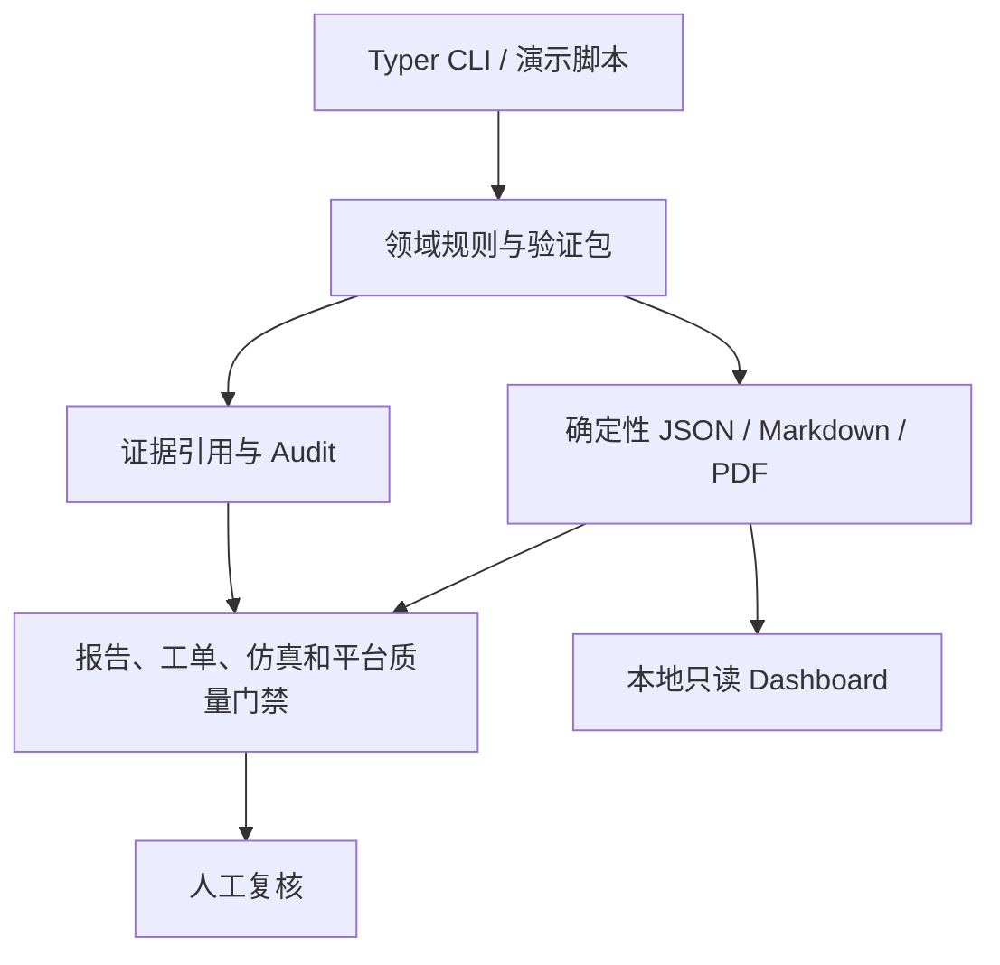

# 架构说明

## 总体架构

当前项目采用离线 CLI 与本地只读展示架构。`apps/cli` 负责参数解析、文件编排和稳定退出状态；领域逻辑位于 `packages/`，每个包负责一个清晰职责；`scripts/` 提供可重复的本地演示编排。所有输入均来自本地 sample / mock / sanitized 文件。

## 核心数据流

1. `log_parsers` 离线读取 CSV、JSON、PX4 ULog 或 ArduPilot BIN，并映射为统一日志记录。
2. `telemetry_rules` 和 `anomaly_detection` 生成飞行摘要与带 `evidence_refs` 的异常。
3. `diagnosis_rules` 和 `maintenance_rules` 生成故障假设与维护建议。
4. `simulation` 导入离线/mock 仿真结果并输出逐规则验证结论。
5. `report_templates` 生成 Markdown/PDF 运维报告，`report_validation` 检查章节、引用和证据链。
6. `work_orders` 将维护建议转换为本地 `DRAFT` 工单并执行离线质量门禁。
7. `fleet_health` 汇总多资产样例，`dashboard` 生成本地只读数据包和页面。
8. `platform_readiness`、`platform_index` 与 `operations_platform` 对数据、适配器、审批、交接和平台能力执行确定性验证。
9. `audit_logger` 为关键步骤写入审计记录，所有关键结论保持 `human_review_required=true`。

## Agent、Skill 与实现边界

- `agents/` 描述编排角色和职责，不直接承载外部执行能力。
- `skills/` 定义可复用能力的输入、输出、硬规则、证据要求和审计要求。
- `packages/` 包含可测试的领域实现。
- `apps/cli` 只做本地命令编排。
- `scripts/generate_demo_outputs.py` 只编排现有离线能力，不复制业务规则。

## 安全边界

系统不连接真实无人机、飞控、外部仿真器、真实维修系统或 fleet platform，不执行 MAVLink command、自动派单、固件上传或飞控参数写入。未来任何外部适配都必须保持 read-only/offline import 与命令执行严格隔离，并经过独立安全审查。
