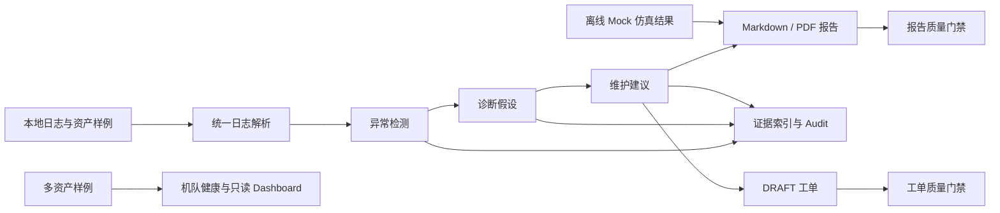

# drone-ops-agent 项目总览

## 项目定位

`drone-ops-agent` 是一个离线优先的无人机运维决策支持平台。它读取本地 sample、mock、sanitized 或明确登记来源的开源上游日志，将数据转换为飞行摘要、异常、诊断假设、维护建议、运维报告、证据索引、审计记录和待人工审批的工单草稿。

项目解决的是“如何让运维分析结果可追溯、可验证、可展示”，不是无人机自动控制系统。所有结论均为 advisory-only，关键输出默认要求人工复核。

## 已实现主链路



## 核心能力

- 日志解析：CSV、JSON、PX4 ULog、ArduPilot BIN 的离线适配。
- 运维分析：异常检测、故障假设、维护建议和人工复核要求。
- 仿真验证：14 个 offline/mock 场景，覆盖 PASS、REVIEW_REQUIRED、FAIL、INVALID_INPUT。
- 报告与证据链：Markdown/PDF、`evidence_index.json`、`report_validation.json` 和 audit。
- 运维闭环：维护建议生成本地 `DRAFT` 工单，并执行工单质量门禁。
- 平台视图：机队健康汇总、本地只读 Dashboard、dataset/adapter/approval/handoff/readiness 验证。
- 评测：15 个离线案例的预期状态匹配率和证据覆盖率基线。
- 上游日志兼容：3 个固定 commit、许可证、大小和 SHA-256 的 PX4/pyulog fixture 兼容性案例。
- 可复现分发：受约束临时环境、wheel/sdist smoke test、确定性源码 ZIP 和校验和。

## 如何查看实际效果

```bash
python scripts/build_portfolio_showcase.py --out portfolio_showcase
```

优先查看：

1. `portfolio_showcase/demo_outputs/reports/ops_report.pdf`
2. `portfolio_showcase/demo_outputs/reports/evidence_index.json`
3. `portfolio_showcase/demo_outputs/reports/simulation_run.json`
4. `portfolio_showcase/demo_outputs/reports/work_order_drafts.md`
5. `portfolio_showcase/demo_outputs/fleet/fleet_health_report.md`
6. `portfolio_showcase/demo_outputs/case_studies/case_study_report.md`
7. `portfolio_showcase/demo_outputs/dashboard/dashboard_bundle.json`

## 结果应如何解释

- 15 个案例的预期状态匹配率为 1.0，说明当前确定性规则对仓库内 golden/mock 输入符合预期，不代表真实飞行场景的统计准确率。
- 3 个上游 ULog 可解析，说明 parser 对这些固定 fixture 兼容；registry 明确保留 `real_world_flight_verified=false`。
- `PASS` 表示输入满足当前离线规则，不代表适航、维修或飞行授权。
- 项目没有真实无人机连接、MAVLink command execution、自动派单、飞控参数写入或仿真器启动能力。

## 适合作品展示的工程点

- 领域 schema、规则、CLI、报告和审计分层清晰。
- JSON、Markdown 和评测结果结构稳定，适合 golden/snapshot 测试。
- 质量门禁覆盖报告、证据链、仿真、工单、数据集、适配器和平台 readiness。
- 对真实数据、开源 fixture、mock 数据和未验证能力使用明确边界表述。
- 支持 Windows 本地复现、GitHub Actions Python 3.11/3.12 和带 SHA-256 的发布资产。

## 安全边界

系统保持 offline-only、advisory-only、human-review-required。不连接真实无人机，不执行 arm/disarm、takeoff、landing、RTL、mission execution、motor start、firmware upload、flight-controller parameter writing 或任何 MAVLink command；不启动或连接 PX4、ArduPilot、Gazebo、SITL；不接入真实维修系统或 fleet platform。
