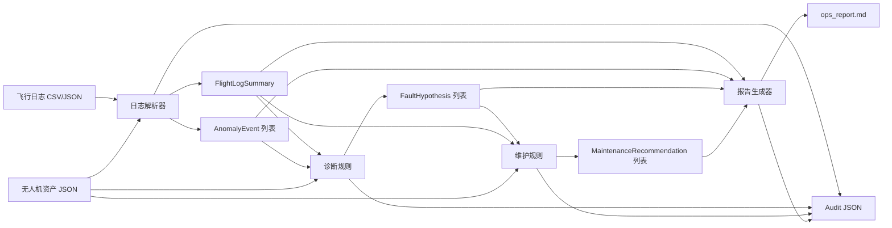

# 无人机运维 Agent MVP 设计

日期：2026-06-24

## 目标

构建 `drone-ops-agent`，一个面向生产级 MVP 的离线无人机运维支持系统。系统用于降低人工调试、故障排查、维护规划和报告撰写的工作量，但不直接控制任何真实无人机硬件。

MVP 是一个 Python 3.11+ CLI 应用。它基于样例飞行日志和样例资产数据运行确定性的规则分析，并输出可审计结果：

- `flight_summary.json`
- `anomalies.json`
- `diagnosis.json`
- `maintenance_recommendations.json`
- `ops_report.md`
- 每次 skill 运行对应的 audit JSON 文件

## Markdown 语言约定

本项目中的 `.md` 文件统一使用中文撰写，包括 `README.md`、`docs/*.md`、`skills/*/SKILL.md`、设计文档和实现计划。代码标识符、命令、字段名和文件名保持英文，以便与 Python 包、CLI 和 JSON schema 对齐。

## 安全边界

系统只能作为运维支持和决策辅助工具。代码、命令、接口和工作流中不得包含解锁电机、启动电机、起飞、降落、返航、航线飞行、上传固件、修改飞控关键参数、arm/disarm 飞行器或任何真实飞控命令。

任何涉及飞行安全、维护安全或飞控参数变更的建议，都必须要求人工复核和批准。MVP 中影响安全或维护决策的诊断与维护输出默认设置 `human_review_required=true`。

## 范围

### MVP 范围内

- 当前空仓库的初始实现。
- 使用 Pydantic 领域模型的 Python 包结构。
- CSV 和 JSON 飞行日志解析。
- 确定性的规则型异常检测。
- 生成按置信度排序的规则型故障假设。
- 生成规则型维护建议。
- Markdown 运维报告生成。
- 每次 skill 执行写入审计日志。
- Typer CLI 命令：
  - `drone-ops analyze-log`
  - `drone-ops diagnose`
  - `drone-ops generate-report`
  - `drone-ops run-mvp`
- 样例资产、日志、任务和报告目录。
- 可通过 `pytest` 运行的单元测试、集成测试和 golden 测试。
- 架构、安全、审计、数据契约、Codex 工作流和路线图文档。
- 所有请求的 skill 目录都包含完整的 `SKILL.md`、`schema.json`、`examples/` 和 `tests/`。

### MVP 范围外

- 真实无人机硬件集成。
- MAVLink 命令执行。
- PX4 ULog 或 ArduPilot BIN 解析。
- SITL 实际运行。
- Web Dashboard。
- PDF 生成。
- 工单系统或 CMMS 集成。
- 基于机器学习的诊断。

这些能力作为后续扩展点记录在文档中。

## 推荐架构

当前工作目录就是项目根目录。用户要求的 `drone-ops-agent/` 内部内容会直接创建在当前工作目录下。

核心模块：

- `packages/drone_schemas`：Pydantic 领域对象和共享枚举。
- `packages/log_parsers`：CSV 和 JSON 飞行日志读取器。
- `packages/telemetry_rules`：飞行摘要计算和基础指标计算。
- `packages/anomaly_detection`：确定性异常检测规则。
- `packages/diagnosis_rules`：故障假设排序规则。
- `packages/maintenance_rules`：维护建议生成规则。
- `packages/report_templates`：Markdown 报告渲染。
- `packages/audit_logger`：审计记录创建和 JSON 持久化。
- `apps/cli`：Typer CLI 入口和工作流编排。

`agents/` 目录在 MVP 阶段保持轻量，用于记录各 agent 的职责边界，后续可承载更复杂的编排逻辑。

`skills/` 目录是可复用能力的运行契约。MVP 可运行逻辑放在 Python 包中，每个 skill 目录负责描述输入、输出、硬规则、证据要求、审计要求、测试、已知限制和未来扩展。

## 数据流

1. `analyze-log` 加载飞行日志和资产文件。
2. 日志解析器将记录验证为 `FlightLogRecord` 对象。
3. 摘要逻辑生成 `FlightLogSummary`。
4. 异常规则生成带证据引用的 `AnomalyEvent` 列表。
5. 命令写入 `flight_summary.json`、`anomalies.json` 和审计文件。
6. `diagnose` 加载摘要、异常和资产数据，生成排序后的 `FaultHypothesis` 列表。
7. 维护逻辑结合故障假设、资产和摘要，生成 `MaintenanceRecommendation` 列表。
8. `generate-report` 根据摘要、诊断、维护建议和审计元数据渲染 PDF-ready Markdown 报告。
9. `run-mvp` 串联完整流程，并用确定性文件名写出全部结果。



## 领域模型

Pydantic 模型包括：

- `DroneAsset`
- `BatteryAsset`
- `MissionPlan`
- `PreflightObservation`
- `PreflightCheckResult`
- `TelemetrySnapshot`
- `FlightLogRecord`
- `FlightLogSummary`
- `AnomalyEvent`
- `FaultHypothesis`
- `MaintenanceRecommendation`
- `SimulationScenario`
- `SimulationRun`
- `OpsReport`
- `EvidenceRef`
- `SkillRunAudit`

重要输出对象包含标识符、时间戳、证据或来源引用、适用的严重级别和置信度、`human_review_required`、`generated_by_skill` 和 `skill_version`。

`EvidenceRef` 是可追溯性的核心，记录 source type、source id、timestamp、field、measured value、threshold、rule id 和 description。

`SkillRunAudit` 记录 run id、skill name、skill version、input refs、tools called、rules triggered、output refs、human-review flag、reviewer、created time 和 status。

## 规则行为

### 日志摘要

日志解析和摘要层计算：

- 飞行时长
- 最低电池电压
- 最大电流
- 最低电池 SOC
- GPS 质量摘要
- 振动摘要
- 电机输出不平衡摘要
- 通信链路摘要
- 飞行模式切换时间线
- 检测到的异常事件

### 异常检测

MVP 规则覆盖：

- 电池电压骤降
- 低电量 SOC
- 电流过高
- GPS 质量下降
- HDOP 过高
- 卫星数过低
- 振动过高
- 电机输出不平衡
- 通信链路质量下降
- 温度过高
- 非预期飞行模式切换

每个异常包含 anomaly id、type、severity、timestamp 或时间范围、evidence refs、human-readable summary、rule id、measured value 和 threshold。

### 故障诊断

诊断输出按置信度排序的多个假设。除非证据非常充分，否则不输出唯一确定根因。MVP 规则覆盖：

- 桨叶损伤或动平衡异常
- 电机性能衰退
- 电池健康衰退
- GPS 接收问题
- 传感器振动问题
- 通信链路问题
- 热异常问题

故障假设包含置信度、严重级别、支持证据、反证、建议下一步和人工复核要求。

### 维护建议

维护建议把故障假设映射为动作，优先级包括：

- `IMMEDIATE_GROUNDING`
- `BEFORE_NEXT_FLIGHT`
- `POST_FLIGHT_INSPECTION`
- `SCHEDULED_MAINTENANCE`
- `MONITOR`

每条建议包含 component、action、priority、reason、evidence refs、required approval、estimated effort 和 human-review flag。

## CLI 设计

命令：

```bash
drone-ops analyze-log --log data/sample_logs/example_flight.csv --asset data/sample_assets/uav_001.json --out data/sample_reports/
drone-ops diagnose --summary data/sample_reports/flight_summary.json --asset data/sample_assets/uav_001.json --out data/sample_reports/
drone-ops generate-report --summary data/sample_reports/flight_summary.json --diagnosis data/sample_reports/diagnosis.json --maintenance data/sample_reports/maintenance.json --out data/sample_reports/report.md
drone-ops run-mvp --log data/sample_logs/example_flight.csv --asset data/sample_assets/uav_001.json --out data/sample_reports/
```

`diagnose` 默认从 summary 所在目录读取 `anomalies.json`。如果后续需要，可以增加显式 `--anomalies` 参数。

## 错误处理

- 输入文件缺失时，错误信息包含具体路径。
- JSON 或 CSV schema 无效时，错误信息包含文件和字段。
- 日志为空时，在执行规则前失败。
- 缺少必要上游产物时，报告生成失败并说明缺失内容。
- 成功执行的 skill 都写入审计记录。失败运行审计可在首版 MVP 后补充更细的命令级异常记录。

## 测试

测试层次：

- 单元测试：
  - schema validation
  - log parsing
  - anomaly rules
  - diagnosis ranking
  - maintenance recommendation generation
  - report rendering
  - audit record creation
- 集成测试：
  - 跨模块命令编排
- Golden 测试：
  - 基于样例数据的完整 `run-mvp` 流程和确定性输出结构

主要验证命令：

```bash
pytest
```

## 文档

文档文件：

- `README.md`：项目用途、安全边界、安装、MVP 运行、测试、添加 skill、查看审计日志。
- `docs/architecture.md`：系统架构、数据流、agent 和 skill 边界、扩展点。
- `docs/safety_policy.md`：允许动作、禁止动作、human-in-the-loop 要求、飞行关键动作限制。
- `docs/audit_policy.md`：记录内容、审计原因、证据追溯方式。
- `docs/data_contracts.md`：核心 schema 概览。
- `docs/codex_workflows.md`：后续可交给 Codex 的任务。
- `docs/roadmap.md`：MVP 和后续路线图。

## 实现顺序

1. 创建项目骨架、`pyproject.toml`、docs、package 目录和 skill 目录。
2. 实现 Pydantic schema。
3. 添加样例资产和样例飞行日志。
4. 实现日志解析和摘要计算。
5. 实现异常检测规则。
6. 实现诊断和维护规则。
7. 实现审计日志。
8. 实现 Markdown 报告生成。
9. 实现 Typer CLI 编排。
10. 添加测试和 golden 流程。
11. 运行 `pytest`，修复失败，并验证 CLI MVP。

## 验收标准

- `pytest` 通过。
- CLI MVP 可以处理样例数据。
- 生成要求的 JSON、Markdown 和 audit 文件。
- 每个异常、诊断和维护建议都包含 evidence references。
- 飞行关键或维护关键建议必须要求人工复核。
- 代码中不尝试控制真实无人机硬件。
- README 和文档说明如何运行和扩展项目。

## 已知取舍

- MVP 优先确定性、可测试规则，而不是高级 agent 自主能力。
- CLI 编排保持系统简单且离线优先。
- `agents/` 目录在首版中保持轻量，等待外部集成或更复杂编排需求出现后再扩展。
- 报告使用 Markdown 且结构 PDF-ready，但 PDF 生成推迟到后续阶段。
