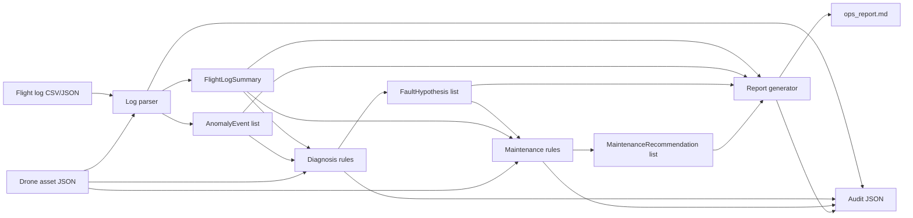

# Drone Ops Agent MVP Design

Date: 2026-06-24

## Goal

Build `drone-ops-agent`, a production-oriented offline MVP for drone operations support. The system reduces manual debugging, fault triage, maintenance planning, and report writing effort without directly controlling any real drone hardware.

The MVP is a Python 3.11+ CLI application. It processes sample flight logs and sample asset data, produces deterministic rule-based analysis, and writes auditable outputs:

- `flight_summary.json`
- `anomalies.json`
- `diagnosis.json`
- `maintenance_recommendations.json`
- `ops_report.md`
- audit JSON files for each skill run

## Safety Boundary

The system is advisory only. It must not contain commands, APIs, or workflows that arm or disarm vehicles, unlock or start motors, trigger takeoff, landing, return-to-home, waypoint flight, firmware upload, flight-controller parameter changes, or any other real flight-control action.

Any flight-safety, maintenance-safety, or flight-parameter-related recommendation must require human review and approval. MVP diagnostic and maintenance outputs default to `human_review_required=true` when they influence safety or maintenance decisions.

## Scope

### In Scope

- Empty-repository initial implementation.
- Python package structure using Pydantic domain models.
- CSV and JSON flight-log parsing.
- Deterministic anomaly detection rules.
- Rule-based fault diagnosis producing ranked hypotheses.
- Rule-based maintenance recommendations.
- Markdown operations report generation.
- Audit log creation for each skill execution.
- Typer CLI commands:
  - `drone-ops analyze-log`
  - `drone-ops diagnose`
  - `drone-ops generate-report`
  - `drone-ops run-mvp`
- Sample assets, logs, missions, and reports.
- Unit, integration, and golden tests runnable with `pytest`.
- Documentation for architecture, safety, audit policy, data contracts, Codex workflows, and roadmap.
- Complete `SKILL.md`, `schema.json`, `examples/`, and `tests/` directories for all requested skills.

### Out of Scope for MVP

- Real drone hardware integration.
- MAVLink command execution.
- PX4 ULog or ArduPilot BIN parsing.
- SITL execution.
- Web dashboard.
- PDF generation.
- Work order or CMMS integration.
- Machine-learning-based diagnosis.

These are kept as documented extension points.

## Recommended Architecture

The repository root is the project root. The requested `drone-ops-agent/` contents are created directly in the current workspace.

Core modules:

- `packages/drone_schemas`: Pydantic domain objects and shared enums.
- `packages/log_parsers`: CSV and JSON flight-log readers.
- `packages/telemetry_rules`: summary calculations and low-level metrics.
- `packages/anomaly_detection`: deterministic anomaly rules.
- `packages/diagnosis_rules`: ranked fault hypothesis generation.
- `packages/maintenance_rules`: maintenance recommendation generation.
- `packages/report_templates`: Markdown report rendering.
- `packages/audit_logger`: audit record creation and JSON persistence.
- `apps/cli`: Typer CLI entrypoint and orchestration glue.

Agent directories under `agents/` are thin placeholders in MVP. They document responsibility boundaries and can later host richer orchestration logic.

Skill directories under `skills/` are operational contracts. The runnable MVP behavior lives in Python packages; each skill directory documents inputs, outputs, hard rules, evidence requirements, audit behavior, tests, limitations, and future extensions.

## Data Flow

1. `analyze-log` loads a flight log and asset file.
2. The log parser validates records into `FlightLogRecord` objects.
3. Summary logic creates a `FlightLogSummary`.
4. Anomaly rules create `AnomalyEvent` records with evidence references.
5. The command writes `flight_summary.json`, `anomalies.json`, and an audit file.
6. `diagnose` loads summary, anomalies, and asset data, then creates ranked `FaultHypothesis` records.
7. Maintenance logic converts hypotheses plus asset and summary context into `MaintenanceRecommendation` records.
8. `generate-report` renders a PDF-ready Markdown report from summary, diagnosis, maintenance, and audit metadata.
9. `run-mvp` runs the full flow and writes all outputs in deterministic filenames.



## Domain Models

Pydantic models include:

- `DroneAsset`
- `BatteryAsset`
- `MissionPlan`
- `PreflightObservation`
- `PreflightCheckResult`
- `TelemetrySnapshot`
- `FlightLogRecord`
- `FlightLogSummary`
- `AnomalyEvent`
- `FaultHypothesis`
- `MaintenanceRecommendation`
- `SimulationScenario`
- `SimulationRun`
- `OpsReport`
- `EvidenceRef`
- `SkillRunAudit`

Important output models include identifiers, timestamps, evidence or source references, applicable severity and confidence, `human_review_required`, `generated_by_skill`, and `skill_version`.

`EvidenceRef` is the traceability backbone. It records source type, source id, timestamp, field, measured value, threshold, rule id, and description.

`SkillRunAudit` records run id, skill name, skill version, input refs, tools called, rules triggered, output refs, human-review flag, reviewer, creation time, and status.

## Rule Behavior

### Log Summary

The parser and summary layer calculate:

- flight duration
- minimum battery voltage
- maximum current
- minimum battery SOC
- GPS quality summary
- vibration summary
- motor output imbalance summary
- communication link summary
- flight mode transition timeline
- detected anomaly events

### Anomaly Detection

MVP rules cover:

- battery voltage drop
- low battery SOC
- high current
- GPS quality degradation
- high HDOP
- low satellite count
- high vibration
- motor output imbalance
- communication link quality degradation
- high temperature
- unexpected flight mode transition

Each anomaly contains an anomaly id, type, severity, timestamp or range, evidence refs, human-readable summary, rule id, measured value, and threshold.

### Fault Diagnosis

Diagnosis produces ranked hypotheses, not a single definitive root cause unless evidence is exceptionally strong. MVP rules cover:

- propeller damage or dynamic balance issue
- motor performance degradation
- battery health degradation
- GPS reception issue
- sensor vibration issue
- communication link issue
- thermal anomaly issue

Hypotheses include confidence, severity, supporting evidence, counter evidence, next steps, and human-review requirements.

### Maintenance Advice

Maintenance recommendations map fault hypotheses to actions with priorities:

- `IMMEDIATE_GROUNDING`
- `BEFORE_NEXT_FLIGHT`
- `POST_FLIGHT_INSPECTION`
- `SCHEDULED_MAINTENANCE`
- `MONITOR`

Each recommendation includes component, action, priority, reason, evidence refs, required approval, estimated effort, and human-review flag.

## CLI Design

Commands:

```bash
drone-ops analyze-log --log data/sample_logs/example_flight.csv --asset data/sample_assets/uav_001.json --out data/sample_reports/
drone-ops diagnose --summary data/sample_reports/flight_summary.json --asset data/sample_assets/uav_001.json --out data/sample_reports/
drone-ops generate-report --summary data/sample_reports/flight_summary.json --diagnosis data/sample_reports/diagnosis.json --maintenance data/sample_reports/maintenance.json --out data/sample_reports/report.md
drone-ops run-mvp --log data/sample_logs/example_flight.csv --asset data/sample_assets/uav_001.json --out data/sample_reports/
```

`diagnose` also reads `anomalies.json` from the summary output directory by default. If needed, a later enhancement can add an explicit `--anomalies` option.

## Error Handling

- Missing input files fail with clear path-specific errors.
- Invalid JSON or CSV schema failures name the file and field.
- Empty logs fail before rule execution.
- Report generation fails if required upstream artifacts are absent.
- Audit records are written for successful skill runs. Failed-run audit can be added after the initial MVP if command-level exception handling needs deeper coverage.

## Testing

Test layers:

- Unit tests:
  - schema validation
  - log parsing
  - anomaly rules
  - diagnosis ranking
  - maintenance recommendation generation
  - report rendering
  - audit record creation
- Integration tests:
  - command orchestration across multiple modules
- Golden tests:
  - full `run-mvp` flow over sample data with deterministic output structure

Primary verification command:

```bash
pytest
```

## Documentation

Documentation files:

- `README.md`: purpose, safety boundary, install, MVP run, tests, adding skills, audit logs.
- `docs/architecture.md`: architecture, data flow, agent and skill boundaries, extension points.
- `docs/safety_policy.md`: allowed and disallowed actions, human-in-the-loop rules, flight-critical restrictions.
- `docs/audit_policy.md`: logged content, audit rationale, evidence traceability.
- `docs/data_contracts.md`: core schema overview.
- `docs/codex_workflows.md`: future Codex tasks.
- `docs/roadmap.md`: MVP and post-MVP roadmap.

## Implementation Order

1. Create project skeleton, `pyproject.toml`, docs, package directories, and skill directories.
2. Implement Pydantic schemas.
3. Add sample asset and sample flight logs.
4. Implement log parsing and summary calculation.
5. Implement anomaly detection rules.
6. Implement diagnosis and maintenance rules.
7. Implement audit logger.
8. Implement Markdown report generation.
9. Implement Typer CLI orchestration.
10. Add tests and golden flow.
11. Run `pytest`, fix failures, and verify CLI MVP.

## Acceptance Criteria

- `pytest` passes.
- CLI MVP processes sample data.
- Required JSON, Markdown, and audit files are generated.
- Every anomaly, diagnosis, and maintenance recommendation contains evidence references.
- Flight-critical or maintenance-critical recommendations require human review.
- No code attempts to control real drone hardware.
- README and docs explain how to operate and extend the project.

## Known Tradeoffs

- The MVP prioritizes deterministic, testable rules over advanced agent autonomy.
- CLI orchestration keeps the system simple and offline-first.
- Agent directories are intentionally thin until external integrations or richer orchestration are needed.
- Reports are Markdown and PDF-ready, but PDF generation is deferred.
